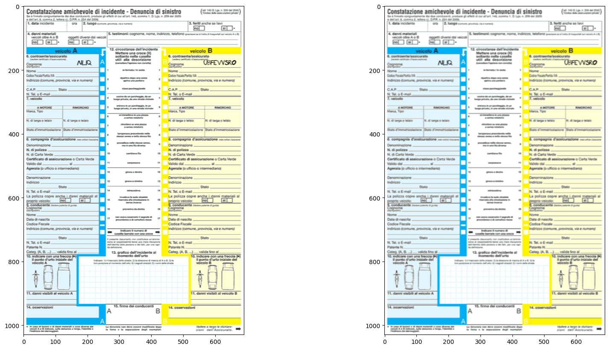
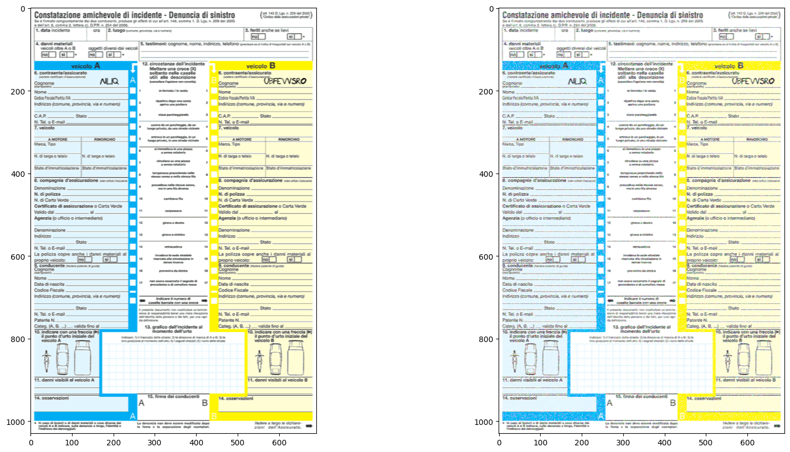
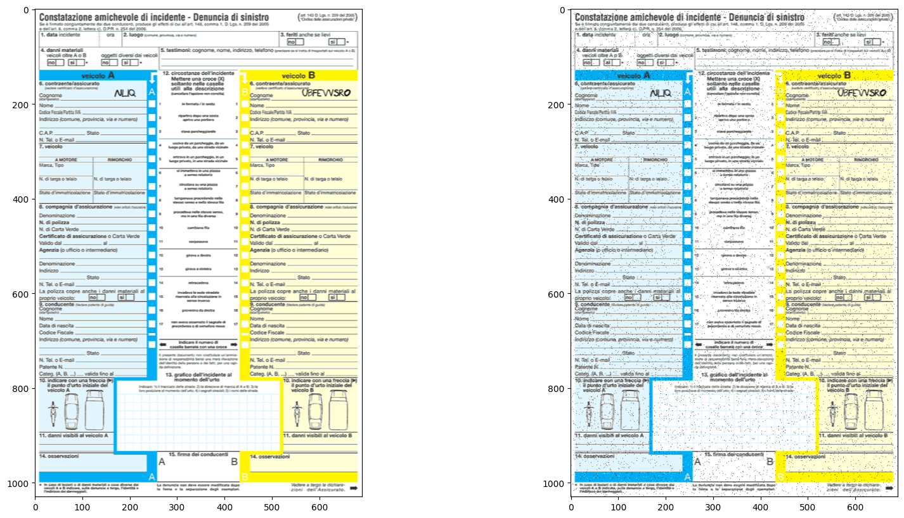
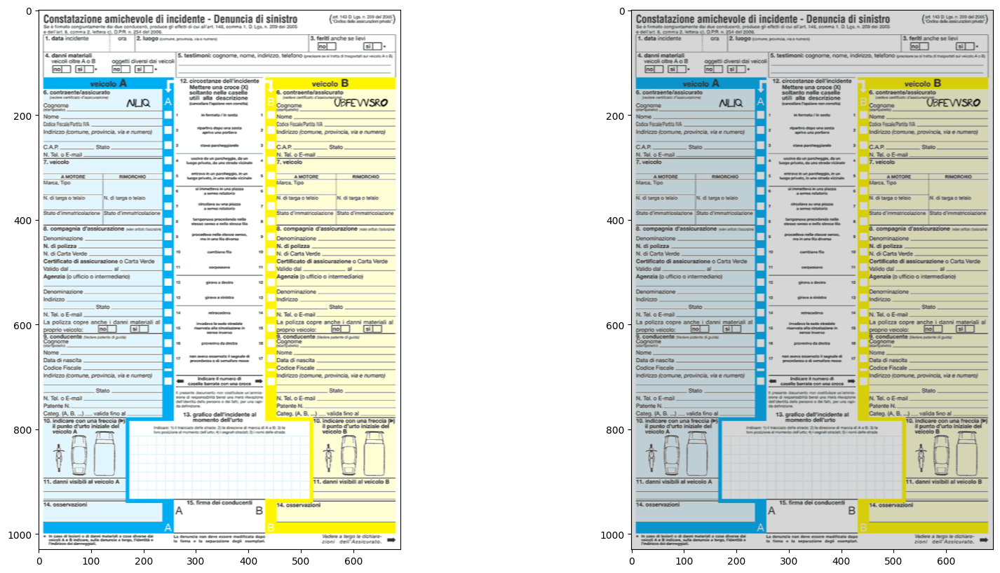
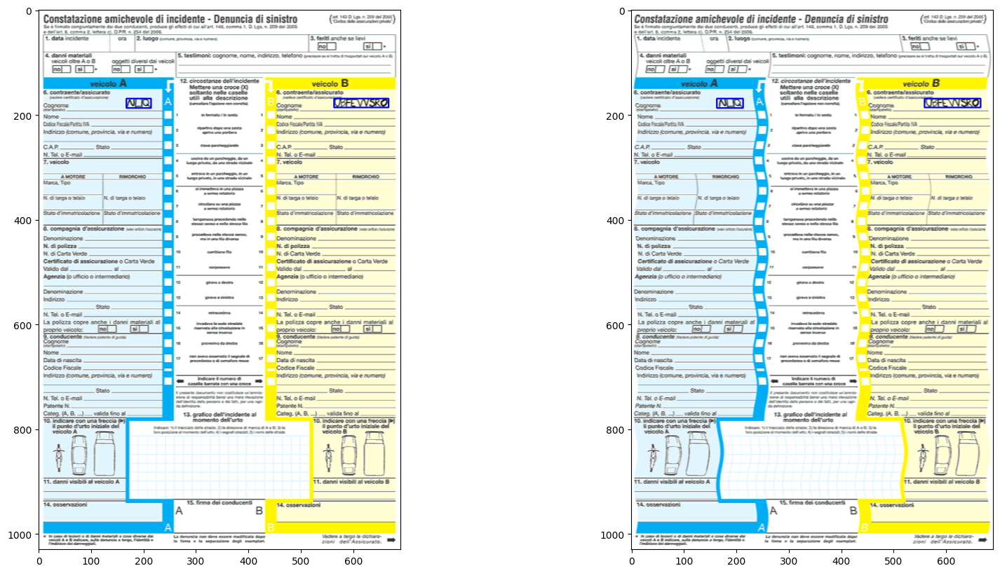
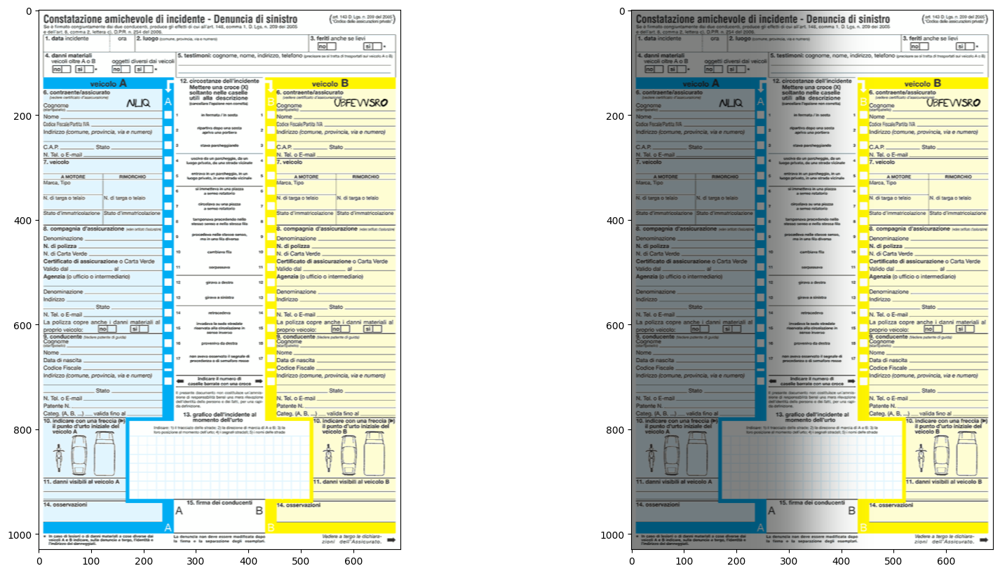
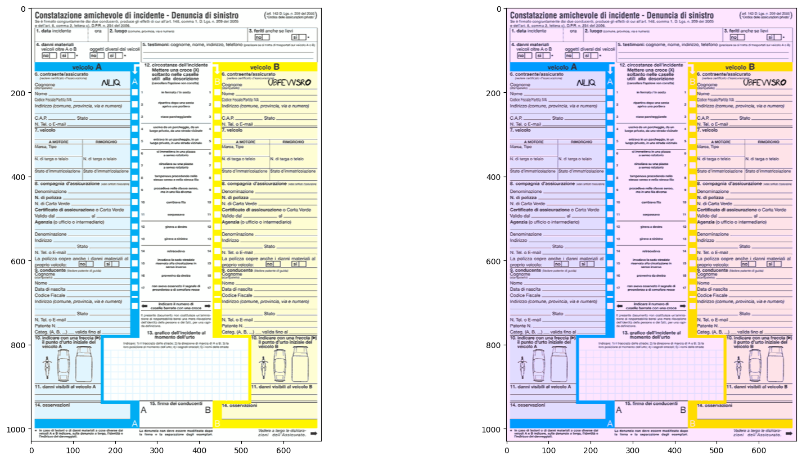

## Sample Generation Job
This job aims to generate samples of synthetic data based on template document and bounding boxes. The template document will be filled with handwritten text using bounding boxes information.
The generated data is versioned and subdivided into train and test datasets.

### Job Inputs
- <b>document_id</b>: the id of the document, this is used to retrieve the document template and buonding boxes via API
- <b>num_samples</b>: this parameter specify the number of samples to generate
- <b>config_file_path</b>: is the path of the yaml configuration file to use, in this file all the degradations and parameters are defined. default = `./jobs/sample_generation/config/degradation_config.yaml`
- <b>output_base_path</b>: the path to use to write output samples. default = `./data`

### Job Configuration
The job take as input a yaml configuration file defining all the possible degradations that can be applied and the corresponding parameters. The parameters can be difined in three ways:
- an explicit list from where a random element is picked
- by defining `min`, `max` and `step` parameters that will generate a list at runtime and a randome element is picked at runtime.
- by deinining an explicit single value


```yaml
ShadowDegradation:
  direction: 
    - "diagonal"
    - "left"
    - "right"
    - "top"
    - "bottom"
  "intensity": 
    min: 0.1
    max: 0.6
    step: 0.1
  "blur":
    min: 50
    max: 300
    step: 50
  "len_percentage":
    min: 0.1
    max: 0.9
    step: 0.1
```

### Degradations
During the job execution a set of degradations will be applied randomly to the document image to make it appear more real.
The degradations are defined as classes in `image_degradations.py`.
While `ImageDegradator` class allows to use them in combo to generate a realistic document image.
Here is the list of degradations currently available with some examples:
> #### GaussianBlurDegradation
> 

> #### MotionBlurDegradation
>

> #### GaussianNoiseDegradation
>

> #### SaltPepperNoiseDegradation
>

> #### BrightnessContrastDegradation
>

> #### WaveDistortionDegradation
>

> #### ShadowDegradation
>

> #### ColorFilterDegradation
>

### Output
The job outputs generated samples and annotation in the `{output_base_path}/sampling/document_{document_id}/{version}/{dataset_type}/` folder
